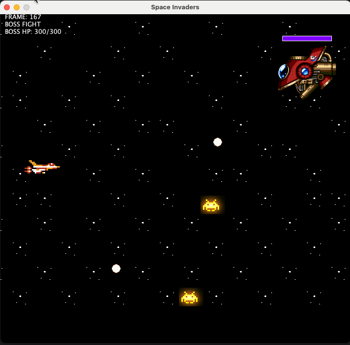
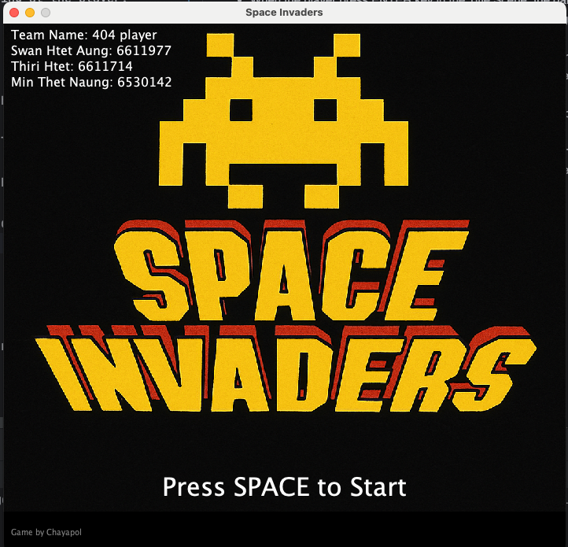
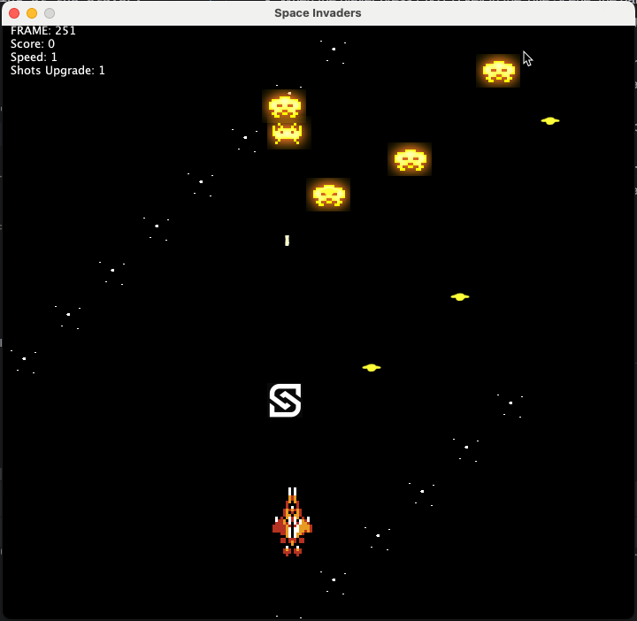
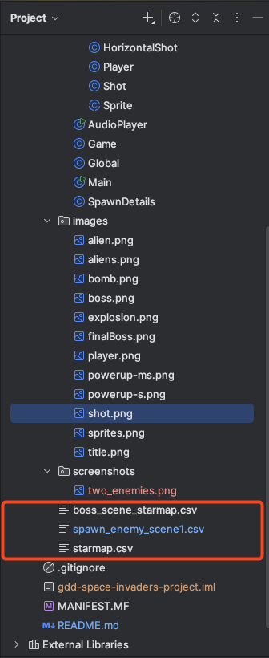

  <h1>GDD Project 1 - Space Invaders 🚀</h1>
  <h2>Team 404 Player</h2>
  <h4>👾 Swan Htet Aung (6611977) - Section 542 👾 Thiri Htet (6611714) - Section 542 👾 Min Thet Naung (6530142) - Section 541</h4>

## 🕹️ Game Overview

Space Invaders is a classic arcade shooter reimagined! Battle waves of aliens, collect power-ups, and face off against a powerful boss in a multi-stage adventure.

## 🎮 Game Description

- The game has three scenes: Title Scene, Scene 1 and Boss Scene.
- When the player press ENTER key in the Title Scene, the game starts.
- Player can move the spaceship left, right, up and down using the arrow keys.
- Player can shoot bullets using the space key.
- Player can get power-ups by collecting with the power-up items. (Speed Up and Multiple Shots)
- There are two enemy types: Vertical Enemy and Zig Zag Enemy.
- The player can defeat the enemies by shooting them.
- The game is over if the player collides with an enemy or the bomb from the enemy.
- After finishing Scene 1, the player will enter the Boss Scene.
- The boss has hp and the hp will decrease when the player shoots the boss.
- The boss can generate two aliens and bombs shooting at the player.
- If the player can beat the boss, the player wins the game.

## Details
1. The boss scene is side scrolled
- 
2. Members names in the title scene
- 
3. Two Types of Enemies
- 
4. Load the array from the CSV file
- 

---

## 📚 References
This project is based on the [Space Invader](https://github.com/janbodnar/Java-Space-Invaders) repository.